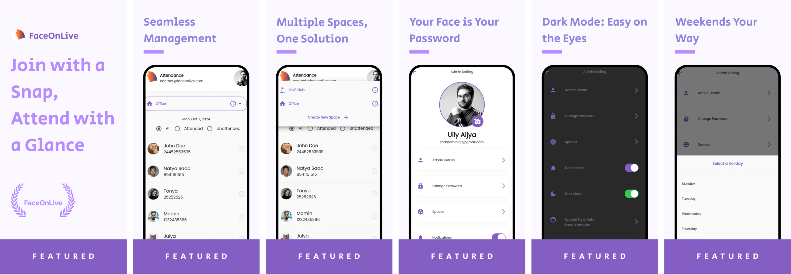

# Face Attendance Project

## Flutter Sample App with Face Recognition SDK

[Video Demo](https://user-images.githubusercontent.com/91896009/164498733-955df7c1-71d6-42e4-8cdc-7e6b7e30e460.mp4)

### Quick Links
[Slack](https://join.slack.com/t/faceonlive/shared_invite/zt-2drx19c5t-vQsR4TUGPD8oL7i7BXdKZA) | [Website](https://www.faceonlive.com/) | [Portfolio](https://portfolio.faceonlive.com) | [Hugging Face](https://www.huggingface.co/FaceOnLive) | [Free APIs](https://getapi.faceonlive.com) | [OpenKYC](https://github.com/FaceOnLive/OpenKYC) | [Face Attendance](https://github.com/FaceOnLive/Mask-Face-Attendance-App-Flutter) | [Contact](mailto:contact@faceonlive.com)

## Prerequisites
- Currently supports Android platform (arm64) only
- New AAR Library required for custom package names
- Flutter and Dart extensions recommended for your code editor
- Google Maps API key and Firebase account needed for full functionality

## Setup Instructions
1. Install [Flutter](https://docs.flutter.dev/get-started/install) and [Android Studio](https://developer.android.com/studio)
2. Clone the project: `git clone https://github.com/Turing311/FaceAttendance.git`
3. (Optional) Change package name: `flutter pub run change_app_package_name:main com.new.package.name` (Disclaimer: If you change the package name, you will need a new AAR Library)
4. Update app name in `android/app/src/main/AndroidManifest.xml`
5. Build APK: `flutter build apk --split-per-abi`
6. Create a Firebase project and set up Firestore
7. Run the project: `flutter run` or use your IDE's run button

## Demos
- You can check the [demo admin panel](https://face-attendance-dcec9.web.app/) here.
- Also for the demo of the app you can use the credentials in release page.

## Firebase Setup
For detailed instructions on setting up Firebase for this project, including authentication and Firestore configuration, please refer to our [Firebase Setup Guide](FIREBASE_SETUP.md).

## Common Errors and Solutions
- Red lines: Run `flutter pub get`
- SDK initialization error: Probably changed the package name
- 

## Features
- [x] Easy attendance management with face verification
- [x] Multiple space support with separate attendance tracking
- [x] Admin and member logins
- [x] QR code for adding members and joining spaces
- [x] Dark mode
- [x] Use phone as a static verifier for automatic attendance
- [x] Weekend change option
- [ ] Face login (Coming soon)

## Data Structure

## Contributing
We welcome contributions! Fork the repository and submit pull requests to help improve the project.

## Support
If you encounter any issues, please [contact us](http://faceonlive.com).

---

Built with [Flutter](https://docs.flutter.dev/get-started/install) and our [Super Fast Face SDK](https://faceonlive.com) 🚀

If you find this project helpful, please star the repository and follow us for updates!