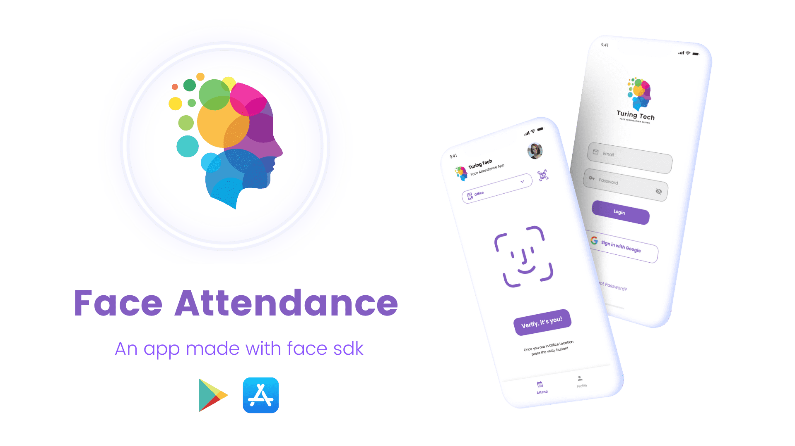

# Face Attendance

An App Made with Face SDK



## Getting Started

## Features
- Attendance management with ease
- Get attendance with face verification
- Fast Face Verification
- Use it as Static device to verify multiple person
- Add a member without in need of another app in their phone
- Multiple Space with seperate attendance on each of them
- Attendance filtering
- Holiday Changing
- Dark Mode
- Member Login
- Admin Login
- Admin managment
- Add Member with qr code
- Join Space with qr code
- ~~Face Login in the app~~ [Coming Soon]
- ~~Daily log and notification~~ [Can be added with cloud functions]
- Space Range Selection [Admin Side]
- ~~ Geolocation based verification ~~ [Coming Soon]

### IF you face plugin error:
- STEP_1: Comment custom camera kit plugin from pubspec.yaml and run flutter pub get
- STEP_2: Add These lines in **"android/app/src/main/java/io/flutter/plugins/GeneratedPluginRegistrant.java"**

``` java 
 import com.ttv.attendance.CamerakitPlugin;
  
  try {
    flutterEngine.getPlugins().add(new CamerakitPlugin());
   } catch(Exception e) {
     Log.e(TAG, "Error registering plugin camera, io.flutter.plugins.camera.CameraPlugin", e);
   }
 ```  
- STEP_3: Uncomment custom camera kit plugin and run flutter pub get